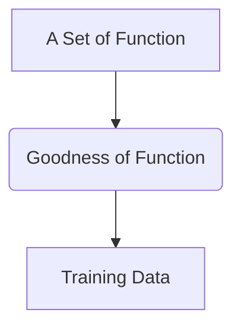

## Regression

*There are lots of applications by using regression, like **Stock Market Forest**, **Self-driving Car**, **Recommendation**.*

### Example Application: 

Estimating the Combat Power of a Pokemon after evolution(emmm just understanding the predicting application)
$$
f (x_w, x_h, ...) = CP\quad after\ evolution
$$

#### step 1: Model

From a set of function find a optimal one. For example, 
$$
\mathbf y = b + w \times x_cp
$$
in the function sets($f_1, f_2, f_3,...$), there are a lot of parameters to be chosen and we can find the optimal one when we complete the training and testing. We called this model as **Linear model**. 
$$
{\hat{y}} = b + \sum{w_ix_i}
$$
$x_i$: an attribute of input x, which called **feature**

$w_i$: weight, $b$: bias

#### step 2 : Goodness of Function

function output is a scalar, for different x, we use the $x^1$ to represent the training set sequences, which means that we have a lot of  training data, like the example put-forward. We can have 10 Pokemon, the $x^1$ can be ${\hat{y}}^1$ after the "$b,w_i$".

But how we decide which function is good or not, we shall define a **Loss Function L** to help the computer find the optimal one by give the good performance parameter some bonus and give the penalty to the bad appearance.

**Loss function $L$:**

input: a function from the function sets,

output: how bad it is

$L ( f ) = L (w , b )$ 

example: 
$$
L(f) = \sum_{n=1}^{10}{({\hat{y}}_n - (b + w.x_{cp}^{n}))^2}
$$
use the real scalar min the predict scalar, and get their square, sum over the examples, we get the estimation error. 

#### step 3: Best Function

We pick the "best" function by find the min$L(f)$ and its $w$ and $b$. 
$$
f^* = arg\ min_fL(f)
$$

$$
w^*,\ b^* =\ arg\ min_{w,b}L(w,b)
$$

$$
=\ arg\ min_{w,b}\sum_{n=1}^{10}{({\hat{y}}^n-(b+w\cdot\ x_{cp}^n))^2}
$$

How to find the $w,\ b$ make the $min(f)$

##### **Gradient Descent**

$$
\nabla L={\left[\matrix{
\frac{\partial L}{\partial w}\\
\frac{\partial L}{\partial b}
}
\right]}_{gradient}
$$

***example***: we consider a loss function which is differentiable $L(w)$ with one parameter $w$, and we shall find the $w^* \ =\ arg\ min_wL(w)$

- (Randomly) Pick an initial value $w^0$

- compute the $t=\frac{dL}{dw}|_{w=w_0}$ (Tangent slope)  if $t$ is Negative, we increase $w$, if $t$ is Positive, we decrease $w$. Because we shall find the $w^*$. In this case, the $t$ is negative, so we shall increase the $w$. We can know the $w^1\ \leftarrow w^0-\eta\frac{dL}{dw}|_{w=w_0}$ and how far we increase, which depends on the constant $\eta$ and the now $t$. $\eta$ is called **learning rate**. If the parameter constant $\eta$ is set big before, we increase more. 

- compute $\frac{dL}{dw}|_{w=w_1}$
  $$
  w^1\ \leftarrow w^0-\eta\frac{dL}{dw}|_{w=w_0}
  $$

  $$
  w^2\ \leftarrow w^1-\eta\frac{dL}{dw}|_{w=w_1}
  $$

  $$
  ...
  $$

  after many **iteration**, we find the **local optimal**. But can't find the **global optimal**.

In linear regression, the loss function $L$ is convex.

$$
L(w,b)=\sum_{n=1}^{10}{({\hat{y}}^n-(b+w\cdot\ x_{cp}^n))^2}
$$

$$
\frac{\partial L}{\partial w}=\sum_{n=1}^{10}{2({\hat{y}}^n-(b+w\cdot\ x_{cp}^n))(-x_{cp}^n)}
$$

$$
\frac{\partial L}{{\partial b}=\sum_{n=1}^{10}{2({\hat{y}}^n-(b+w\cdot\ x_{cp}^n))(-1)}
$$

#### Selecting the another Model

$$
y=b+w_1\cdot x_{cp}+w_2\cdot {(x_{cp})}^2\\
Train\ Average\ Error=15.4\\
Testing\ Average\ Error=18.4
$$

$$
y=b+w_1\cdot x_{cp}+w_2\cdot {(x_{cp})}^2+w_3\cdot {(x_{cp})^3}\\
Train\ Average\ Error=15.3\\
Testing\ Average\ Error=18.1
$$

$$
y=b+w_1\cdot x_{cp}+w_2\cdot {(x_{cp})}^2+w_3\cdot {(x_{cp})^3+w_4\cdot {(x_{cp})}^4}\\
Train\ Average\ Error=14.9\\
Testing\ Average\ Error=28.2
$$

**over-fitting** $\rightarrow$ select suitable model

A more complex model yields lower error on training data, if we can truly find the best function.

A more complex model does not always lead to better performance on testing data.

There are many hidden factor behind the process ,like species...

#### Regularization

$$
y=b+\sum{w_ix_i}
$$

$$
L=\sum_{n=1}{({\hat{y}}_n - (b + w.x_{cp}^{n}))^2\ +\lambda\sum{(w_i)}^2}
$$

$$
\lambda\sum{(w_i)}^2 \qquad \lambda\ is \ a\ constant
$$

* Training error: larger $\lambda$, considering the training error less
* we prefer smooth function, but don't be too smooth.
* select the $\lambda$ obtaining the best model.
* bias not including in the regularization

## Error

error may be from variance, bias.

